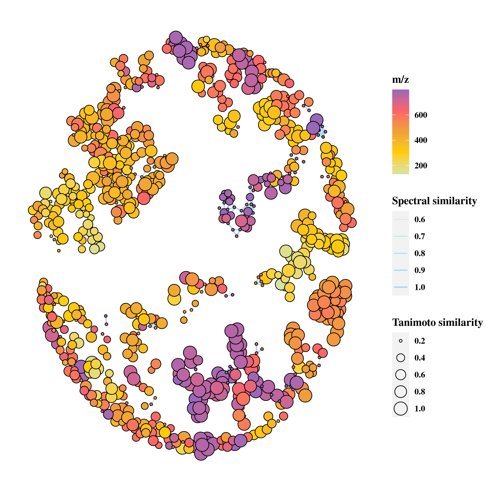

\begin{adjustwidth}{1cm}{1cm}
\centering
\large
\textbf{MCnebula: Critical chemical classes for the classification and boost identification by visualization for untargeted LC-MS/MS data analysis}
\end{adjustwidth}

~

```{r, echo = F, results = 'asis'}
writeLines(readLines("./author.tex"))
```

\tableofcontents

# Other Algorithms details

## ABC selection

### Principle

The principle of ABC selection algorithm: (1) applies an initial filtering to
thousands of chemical classes based on the predicted probability, (2) regards
all 'features' as a whole, examines the number and abundance of 'features' of
each chemical classification (classification at different levels,
classification of sub-structure and dominant structure), and then selects
representative classes, (3) these chemical classes were followed by goodness
assessment (about identification of its classified compounds) and identicality
assessment (the extent to which these chemical classes are distinguished from
each other in the context of MS/MS spectra).  The final chemical classes are
important for the subsequent analysis. They can be visualized as Child-Nebulae,
and these chemical classes (Nebulae) can be used for biomarker or chemistry
discovery. The top 'features' based on statistical analysis could be set as
tracer to discover more homology compounds of chemical structure or spectral
similarity or chemical class.

### Discussion

MCnebula could assist
researchers in focusing on potential markers or interesting compounds
quickly by combining full-spectrum identification with machine
prediction, visualization of Child-Nebulae in a multi-dimensional view,
and statistical analysis to track top 'features' and find analogues. The
ABC selection algorithm can summarize a representative chemical class in
a dataset and obtain the features to that class to make the overall
direction of the study unbiased. Moreover, it is an effective guarantee
for statistical analysis to produce top features for tracing analysis in
next step. The results of statistical analysis based on feature level
may cause bias because of the loss of information, and filtering on the
basis of chemical classes level can prevent the bias to some extent. The
Child-Nebula, which was mapped on the basis of the chemical classes
obtained by the ABC selection algorithm, achieved the visualization of
the huge untargeted dataset as a single graph. The parameters of the ABC
selection algorithm were subjectively adjustable, and they should be
determined according to the richness of the chemical class of the
studied object. In general, our default parameters used to acquire the
chemical classes that are abundant in variety according to the datasets
and filtered out those that were too large or too small classes in
conceptual scope.

## Network graph presentation

The features and their annotations were integrated as Nebulae based on the
Nebula-Index. These Nebulae are represented as network-type graph data. The
feature annotation data includes top candidates for chemical formula and
structure. The MS/MS spectral similarity of the features was calculated and
used to generate the edge data for the network graph.

## Visualization system

MCnebula integrates various R packages to format data, including the 'ggplot2'
package. For the ease of visualization among users, the 'ggset' data class,
which stores pre-defined ggplot2 plotting functions and parameters for
visualizing Nebulae, was developed. Users can customize the visualization
according to their specific needs or the requirements of the publisher.

## Statistical analysis

MCnebula integrates the functions of the 'limma' package for the differential
expression analysis of RNA-sequence and microarray data
[@gentleman_limma_2005-1]. Then, they are
stored as package for the differential analysis of metabolomics data. The gene
expression and feature quantification matrices of LC-MS are similar, and both
have phenotypic variables (sample information) and dependent variables (gene
expression or feature quantification values). The use of our method is
appropriate for the statistical analysis of the feature quantification of
experimental designs, in which explanatory variables are factorial variables,
and the design matrix is without an intercept [@law_guide_2020].

Wozniak et al. used a joint approach of EFS and MWU tests to
screen top metabolites [@2020s]. When 50 top 'features' were obtained
by the 'binary comparison' method integrated in MCnebula with the top 50
metabolites (top 50 of EFS and 50 of MWU) obtained by the joint method
of Wozniak et al., 37 overlapped metabolites were screened out, including the
key metabolite of L-Thyroxine in the reference study. Top 'features'
were usually different according to the feature selection algorithm. The
reliability of the 'binary comparison' method was verified again by our
ranked results compared with those of Wozniak et al.

## Feature detection

Feature detection is a kind of algorithm for detecting peaks from mass data
file, and most mass spectrometry processing tools have a similar function.
Users can implement this process with any tool, but to access the MCnebula
workflow, .mgf (long list file containing MS/MS information) and .csv files (or
other formatted table file of feature quantification) were required for output.
In this study, all processing of Feature detection were implemented in MZmine2
(version 2.53). But now, the R package MCnebula2 has provided some convenient
tools which integrated XCMS (R package) methods or functions for Feature
detection. See details in: <https://mcnebula.org/>.

## Data structure

MCnebula was primarily developed using the R S4 system of
object-oriented programming. All data including 'features' annotation and
visualization data are stored in a single object (class 'mcnebula'), and this
process simplifies the application, making data management and analysis easier
to perform and repeat.

## Reporting system

MCnebula includes a reporting system that enables the analysis process to be
exported in PDF or in other formats. The reporting system is based on the
'report' data class, which stores each step of the analysis as a section and
can be easily modified according to the user requirements.  Furthermore, the
'rmarkdown' R package [@xie_r_2020] was incorporated in the reporting system to
generate reports.

## Code Compatibility

MCnebula performs downstream analysis by extracting data from the pre-computed
SIRIUS project, which is the primary data source for MCnebula 2. The SIRIUS
software is continually updated and enhanced. From SIRIUS version 4 to version
5 (https://github.com/boecker-lab/sirius), the data structure and attribute
names in the project directory have been modified. The effect of other version
problems on MCnebula was eliminated by designing its application programming
interface (API) for various SIRIUS versions.

# Other Experimental details

## Evaluation of MCnebula

The details of simulation of noise were as following:

-   A global mass shift was simulated by drawing a random number
    $\delta^{*}$ from $N\left( 0,\sigma_{mb}^{2} \right)$ (Normal
    distribution) and then shifting every peak mass $m$ by
    $\delta^{*}m$. The standard deviation $\sigma_{mb}$ was chosen as
    $\sigma_{mb} = (10/3) \times 10^{- 6}$ (medium noise) or
    $\sigma_{mb} = (15/3) \times 10^{- 6}$ (high noise), so that
    the $3\sigma_{mb}$ interval represents a 10-ppm shift for medium noise
    and a 15-ppm shift for high noise.

-   Individual mass deviations was simulated by drawing, for each peak
    with mass $m$ individually, a random number $\delta$ from
    $N\left(0,\sigma_{md}^{2} \right)$ and shifting the peak by
    $\delta m$. The standard deviation $\sigma_{md}$ was chosen so that
    the $3\sigma_{md}$ interval represents a 10-ppm shift for medium
    noise and a 20-ppm shift for high noise.

-   Intensity variations were simulated in the spectrum. Each peak
    intensity was multiplied by an individual random number $\epsilon$
    drawn from $N\left( 1,\sigma_{id}^{2} \right)$. Variance was chosen
    as $\sigma_{id}^{2} = 1$ for medium noise and $\sigma_{id}^{2} = 2$
    for high noise. 0.03 times the maximum peak intensity of the
    spectrum was subtracted from each peak intensity. If a peak
    intensity fell below the threshold of one thousands of the maximum
    intensity in the spectrum, the peak was discarded.

-   Additional 'noise peaks' were added to the spectrum. In processing
    of origin dataset, a pool of 'noise peaks' was gathered from the
    fragmentation spectra, using all peaks that did not have a molecular
    sub-formula decomposition of the known molecular formula of the
    precursor. For each spectrum, $\alpha n$ of these 'noise peaks' were
    added to the spectrum, where $n$ is the number of peaks in the
    spectrum and $\alpha = 0.2$ for medium noise and $\alpha = 0.4$ for
    high noise. Intensities of 'noise peaks' were adjusted for maximum
    peak intensities in the contributing and receiving spectrum. 'Noise
    peaks' were randomly drew from the pool of 'noise peaks' and added
    to the spectrum.

   For another issue, the spectra collection did not possess isotopes
pattern. In real LC-MS processing (feature detection), isotope peaks
were grouped and merged, which favorable for SIRIUS to detect some
specific element  [@bocker_sirius_2009]. To simulate isotopes
pattern, we used function of 'get.isotopes.pattern' within 'rcdk' R
package to get isotope mass and its abundance  [@2007j].
Furthermore, these mass were considered for the adduct type to increase
or decrease exact mass. For the 'intensity' of these isotope pattern, we
simulated as relative intensity, i.e., the abundance of isotopes
multiply by 100 by value. These 'isotope peaks' were merged into MS^1^
list of its compounds. All the spectra collections were formatted to fit
with input of MCnebula workflow or benchmark method (.mgf file and
feature quantified table .csv).

### Serum dataset

   We re-analyzed 245 LC-MS/MS data (.mzML) from MASSIVE (id no.
MSV000079949) (blanks, controls and samples)  [@2020s].
MZmine2 (version 2.53) was performed for feature detection. The
detection workflow mainly involves **1)** Automated Data Analysis
Pipeline (ADAP) for peak detection and deconvolution
 [@2017f], **2)** isotopes peak finder, **4)** parallel
samples join alignment, **5)** gap filling algorithm. While we exported
MS/MS spectra (.mgf) for SIRIUS 4 software computation, spectra were
merged across samples into one fragmentation list with 30% Peak Count
threshold filtering. The feature detection workflow was referred to FBMN
preprocessing and SIRIUS computational prerequisites. The output .mgf
was run with SIRIUS 4 software (version 4.9.12) for computation with
SIRIUS  [@duhrkop_sirius_2019], ZODIAC
 [@ludwig_database-independent_2020], CSI:fingerID
 [@duhrkop_searching_2015], CANOPUS
 [@duhrkop_systematic_2021]. In particular, SIRIUS was
customized set to detect Iodine element while predicting formula.
MCnebula package were used for subsequent data analysis. All subsequent
analysis have been organized into concise code and exported as reports
(see section of Data and code availability).

Heat map analysis was performed with
'Acyl carnitines' (ACs), 'Lysophosphatidylcholines' (LPCs)
and 'Bile acids, alcohols and derivatives' (BAs).
The 'features' are select by either in infection groups versus control
groups or HM versus HS group: Q-value &lt; 0.05, |log2(FC)| $\geq$ 0.3.

Kyoto Encyclopedia of Genes and Genomes (KEGG) metabolic pathway
enrichment analysis was performed with LPCs and BAs, respectively. We used
the identified InChIKey planar of structures to hit compounds in
metabolic pathway. In detail, firstly, in order to avoid the identified
structural deviations due to stereoisomerism, the InChIKey planar was
used to obtain all possible InChIKeys via PubChem API. In this step,
PubChem CID of those compounds were also obtained. The R package of
MetaboAnalystR was used for converting PubChem CID to KEGG ID
 [@2020cx]. Many compounds were not related to metabolic
pathway so those were filtered out. The R package of FELLA was used for
KEGG enrichment with 'pagerank' algorithm  [@2018bj]. The
above methods have been integrated as functions to interface with the
MCnebula workflow. These functions are available in the 'exMCnebula2'
package.

### Herbal dataset

   **Material and processing.** *E. ulmoides* dried bark was obtained
from company of ZheJiang ZuoLi Chinese Medical Pieces LTD. Raw-Eucommia
and Pro-Eucommia were prepared as followed: (1) Raw-Eucommia: The shreds
or blocks of *E. ulmoides* dried bark were took, powdered and passed
through 80-mesh sieves for further process. (2) Pro-Eucommia: The shreds
or blocks of *E. ulmoides* dried bark were sprayed with saline water (the
amount of salt is 2% of *E. ulmoides*, add 10 fold of water to
dissolve), and smothered in airtight for 30 min. Then, the barks were
dried in oven at 60 °C, followed by baking at 140 °C for 60 min.
Finally, the baked barks were powdered and passed through 80-mesh sieves
for further process.

   **Sample preparation.** 2 g of Raw-Eucommia powder and Pro-Eucommia
powder were weighed, respectively, added 50 mL of methanol/water (1:1,
v/v) followed by ultrasonic (20 kHz for 40 min). After ultrasonic, the
mixture was filtered to obtain filtrate and residue. The residue was
added with 50 mL of methanol/water (1:1, v/v) and extracted with
ultrasonic (40 kHz, 250 W for 20 min) again. The mixture was filtered.
Then, the filtrate of the two extracts was combined, the solvent was
evaporated. Methanol/water (1:1, v/v) was added to redissolve the
extract and the volume was fixed to 5 mL. Finally, the supernatant was
obtained by centrifugation (12,000 r.p.m. for 10 min) for further LC−MS
analysis.

   **LC-MS experiments.** LC−MS analysis was performed using a Dionex
Ultimate 3000 UHPLC system (Dionex, Germany) coupled with a
high-resolution Fourier-transform mass spectrometer (Orbitrap Elite,
Thermo Fisher Scientific, Germany) using a Waters Acquity HSS T3 column
(1.8 $mu$m, 100 mm $\times$ 2.1 mm, Waters Corporation, Milford, MA, USA).
Solvent A, formic acid/water (0.1:99, v/v), and solvent B, formic
acid/acetonitrile (0.1:99, v/v), were used as the mobile phase. The
gradient profile for separation was as follows: 2% of solvent B at 0min,
5% of solvent B at 2 min, 15% of solvent B at 10 min, 25% of solvent B
at 15 min, 50% of solvent B at 18 min, 100% of solvent B at 23 min, 2%
of solvent B at 25 min, and 2% of solvent B at 30 min. The flow rate was
0.3 mL/min. The column temperature was set at 40°C. Mass spectrometric
analysis was performed using an Orbitrap Elite instrument equipped with
an ESI source (Thermo FisherScientific, Germany) that operated in the
negative ionization mode. The ESI source was operated at 50 °C with a
capillary temperature of 275 °C, an ionization voltage of 3.5 kV, and a
sheath gas flow rate of 35 L/min. The survey scans were conducted in the
Orbitrap mass analyzer operating at a 120,000 (full width at
half-maximum) resolving power. A mass range of 100−1500 m/z and a
normalized collision energy of 30 eV were used for survey scans. The
analysis method was set to analyze the top 10 most intense ions from the
survey scan, and a dynamic exclusion was enabled for 15s.

   **MCnebula Workflow.** E.ulmoides dataset was preprocessed with
MZmine2 for feature detection, followed by SIRIUS software computation. The
subsequent analysis was similar to serum metabolic dataset and also been
organized as a report (see section of Data and code availability).

### Data processing

   Raw data (.raw) were converted to m/z extensible markup language
(mzML, i.e., .mzml format data) in centroid mode using MSConvert
ProteoWizard  [@2012d]. The .mzml files were processed with
MZmine2 (v.2.53) and followed by SIRIUS 4 in Pop!-OS (Ubuntu) 22.04 LTS
64-bits workstation (Intel Core i9-10900X, 3.70GHz $\times$ 20, 125.5 Gb
of RAM)  [@2010]. MCnebula (MCnebula2) and other R packages
were executed in Pop!\_OS (Ubuntu) 22.04 LTS 64-bits PC (Intel Core
i7-1065G7, 1.3 GHz $\times$ 8, 16 Gb of RAM).

### Data and code availability

   The source code of MCnebula was available at
https://github.com/Cao-lab-zcmu/MCnebula. The source code of exMCnebula2
was available at https://github.com/Cao-lab-zcmu/exMCnebula2. The code
for all the analysis in this study can be found in the internal data
directory ('inst/extdata/') of the 'exMCnebula2' package. In addition,
.mgf files (msms spectra) and .csv files (feature quantification) and
SIRIUS output files (use MCnebula function to filter and compress tens
of GB of data to just a few tens of MB) and analysis report of serum and
herbal dataset were compressed and stored in the exMCnebula2 package. By
downloading and installing MCnebula package and exMCnebula2 package, all
the analyses of this study can be reproduced by executing R codes.

The serum dataset were available at MassIVE web service (id no.
[MSV000079949](https://massive.ucsd.edu/ProteoSAFe/QueryMSV?id=MSV000079949)).
The submission job in GNPS of evaluation dataset are available: 1) original
dataset: FBMN:
<https://gnps.ucsd.edu/ProteoSAFe/status.jsp?task=05f492249df5413ba72a1def76ca973d>.
MolnetEnhancer:
<https://gnps.ucsd.edu/ProteoSAFe/status.jsp?task=9d9c7f83fa2046c2bf615a3dbe35ca62>;
2) medium noise dataset: FBMN:
<https://gnps.ucsd.edu/ProteoSAFe/status.jsp?task=c65abe76cd9846c99f1ae47ddbd34927>;
MolnetEnhancer:
<https://gnps.ucsd.edu/ProteoSAFe/status.jsp?task=7cc8b5a2476f4d4e90256ec0a0f94ca7>;
3) high noise dataset: FBMN:
<https://gnps.ucsd.edu/ProteoSAFe/status.jsp?task=62b25cf2dcf041d3a8b5593fdbf5ac5e>;
MolnetEnhancer:
<https://gnps.ucsd.edu/ProteoSAFe/status.jsp?task=f6d08a335e814c5eac7c97598b26fb80>.


# Figure legend of supplementation

&ensp;&ensp; **Fig. S1 | Parent-Nebula of
serum metabolomics dataset.** In **Parent-nebula**, 'features' are mapped as
nodes in network graph. The edges illustrated the spectral similarity of
adjacent 'features'. Not all 'features' are shown in the Parent-Nebula, as
the isolated nodes are removed.



&ensp;&ensp; **Fig. S2 | Child-Nebulae of serum
metabolomics dataset.** The Child-Nebulae are created according to chemical
classes in Nebula-Index. The classified 'features' of chemical classes are
mapped into corresponding Child-Nebulae.


&ensp;&ensp; **Fig. S3 | Showing log~2~(Fold
change) of groups in Child-Nebulae of serum metabolomics dataset.** The
log~2~(Fold change) value of HM versus HS group is shown in Child-Nebulae as
gradient color. The nodes with white color indicate 'features'
with missing quantification value (these 'features' were detected in our
re-analysis, but not in Wozniak et al.)


&ensp;&ensp; **Fig. S4 | In-depth visualization of
Child-Nebulae of 'Lysophosphatidylcholines' and 'Bile acids, alcohols and
derivatives'.** See Fig. 4 for description.


&ensp;&ensp; **Fig. S5 | Pathway analysis of 'Acyl
carnitines' (ACs), 'Lysophosphatidylcholines' (LPCs), 'Bile acids, alcohols and
derivatives' (BAs) in serum metabolomics dataset.** **a)** The carnitine system
in mitochondria.  Abbreviation: CPT1, carnitine-palmitoyltransferase-1; CACT,
carnitine-acylcarnitine translocase; CrAT, carnitine acetyltransferase; CPT2,
carnitine-palmitoyltransferase-2.  **b)** Enrichment analysis of LPCs in
pagerank algorithm with Kyoto Encyclopedia of Genes and Genomes (KEGG)
metabolomic pathway.  Abbreviation: P A2, phospholipase A2; PC-Sterol O-AT,
phosphatidylcholine-sterol O-acyltransferase; LP, lysophospholipase; 1-AGPC
O-AT, 1-acylglycerophosphocholine O-acyltransferase; **c)** Enrichment analysis
of BAs in pagerank algorithm with KEGG metabolomic pathway.  Abbreviation: βGC,
beta-glucuronidase; βGCS, beta-D-Glucuronoside; GT, glucuronosyltransferase;
TCDC 6α-H, taurochenodeoxycholate 6alpha-hydroxylase; TCDC,
taurochenodeoxycholate; GCC, Glycocholate; GCCDC, Glycochenodeoxycholate;
Conju. BAs syn., 'Conjugated bile acid biosynthesis, cholate'; BA-CoA, bile
acid-CoA:amino acid N-acyltransferase.


&ensp;&ensp; **Fig. S6 | Tracing top 'features'
in Child-Nebulae of herbal medicine dataset** According to the rankings of
'features' by statistic analysis, the top 'features' are marked with
different colors in Child-Nebulae.


&ensp;&ensp; **Fig. S7 | MS/MS spectra of top
'features' of herbal medicine dataset.** For top 'features', the mirrored MS/MS
spectra plots illustrated the raw MS/MS spectra (back bar) and the noise
filtered MS/MS spectra (red bar) predicted by SIRIUS. The dot above the bar
implied a corresponding relation.  The top candidate of chemical structure of
'features' are mapped into the plot.


&ensp;&ensp; **Fig. S8 | Extracted ions chromatography
(EIC) of top 'features' of herbal medicine dataset.** The EIC plot illustrates
the peak shape of the top 'features' (drew via MCnebula; detected via Automated
Data Analysis Pipeline (ADAP) algorithm in MZmine2).


&ensp;&ensp; **Fig. S9 | Focus on location of top
'features' in annotated Child-Nebulae.** Fig.  S9
**a**, **b** and **c** illustrate local view of the annotated Child-Nebula of
'Iridoids and derivatives', 'Dialkyl ethers' or 'Phenylpropanoids and
polyketides', respectively. Fig.  S9 **d** and
**e** show the chemical structure of 'feature' (compound) of ID 2110 and ID
854, respectively. Fig. S9 **f** and **g** show the
mirrored MS/MS spectra (refer to Fig. S7 for
description) and extracted ions chromatography (EIC) of the 'features'.


